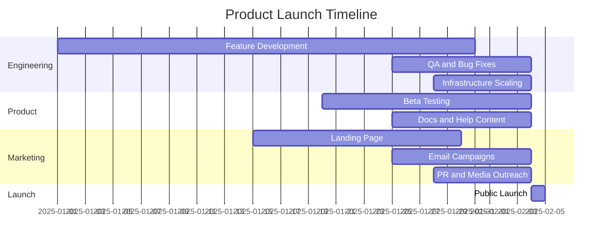

<!-- markdownlint-disable -->

# Lançamento e Growth Hacking: Perspectiva para Desenvolvedores

## Resumo Executivo

Este documento apresenta os fundamentos essenciais de lançamento de produtos e growth hacking, com foco na perspectiva do desenvolvedor de software. Aborda quatro pilares fundamentais: (1) estratégias de lançamento de produtos incluindo pesquisa de mercado, validação, planos de lançamento e campanhas go-to-market; (2) growth hacking e aquisição de usuários através de técnicas criativas e de baixo custo para crescimento rápido; (3) retenção e engajamento de clientes com foco em onboarding, programas de fidelidade e experiências personalizadas; e (4) expansão para novos mercados e escalabilidade com adaptação de produtos e infraestrutura.

Lançamento e growth hacking diferenciam-se da implementação técnica tradicional ao requerer mentalidade de experimentação rápida, foco em métricas de crescimento e capacidade de iterar baseado em dados. Para desenvolvedores, compreender esses conceitos é essencial para construir features que habilitam crescimento viral, implementar sistemas de tracking e analytics para medir experimentos, otimizar funnels de conversão através de A/B testing e criar infraestrutura escalável que suporta crescimento exponencial sem degradação de performance.

## 1. Introdução e Conceitos Fundamentais

### 1.1 Definição de Lançamento de Produto

Lançamento de produto (Product Launch) é o processo estruturado de introduzir um novo produto ou feature significativa ao mercado, envolvendo coordenação entre equipes de produto, marketing, vendas e engenharia para maximizar adoção inicial e estabelecer momentum de crescimento.

No contexto de desenvolvimento de software, lançamentos transcendem deploys técnicos — requerem planejamento estratégico de go-to-market (GTM), criação de buzz pré-lançamento, coordenação de comunicação e monitoramento intensivo de métricas pós-lançamento.

#### 1.1.1 Tipos de Lançamento

**Hard Launch (Big Bang)**
- Lançamento público completo em data específica
- Alto investimento em marketing e PR
- *Exemplo*: Apple lançando novo iPhone com keynote

**Soft Launch (Beta)**
- Lançamento gradual para subset de usuários
- Coleta de feedback antes de escala
- *Exemplo*: Gmail foi beta por 5 anos

**Rolling Launch**
- Lançamento por fases (geografia, segmento, feature flags)
- Reduz risco através de validação incremental
- *Exemplo*: Uber lançando cidade por cidade

**Feature Launch**
- Lançamento de feature dentro de produto existente
- Menor risco mas requer adoção de base existente
- *Exemplo*: GitHub Copilot como feature do VS Code

#### 1.1.2 Fases de Lançamento

**Pre-Launch (Pré-Lançamento)**
- Validação de mercado, MVP, beta testing
- Construção de waitlist, buzz marketing
- *Exemplo Técnico*: Landing page com email capture, feature flags para early access

**Launch (Lançamento)**
- Go-live público, campanhas de marketing
- Monitoramento intensivo de infraestrutura e métricas
- *Exemplo Técnico*: Rollout gradual com feature flags, monitoring com Datadog

**Post-Launch (Pós-Lançamento)**
- Iteração baseada em feedback
- Otimização de conversão e retenção
- *Exemplo Técnico*: A/B testing de onboarding, análise de cohort retention

### 1.2 Definição de Growth Hacking

Growth Hacking é uma abordagem de crescimento focada em experimentos rápidos, de baixo custo e altamente mensuráveis através de canais de produto e marketing para atingir crescimento exponencial de usuários.

Cunhado por Sean Ellis (fundador de GrowthHackers.com), o termo enfatiza mentalidade experimental, foco obsessivo em growth metrics e disposição para "hackear" processos tradicionais de marketing.

#### 1.2.1 Diferenças entre Marketing Tradicional e Growth Hacking

| Aspecto | Marketing Tradicional | Growth Hacking |
|---------|----------------------|----------------|
| **Foco** | Brand awareness, campanhas | Métricas de crescimento (users, revenue) |
| **Orçamento** | Alto (ads, eventos) | Baixo (orgânico, viral) |
| **Velocidade** | Campanhas longas (meses) | Experimentos rápidos (dias/semanas) |
| **Mensuração** | Impressões, reach | Conversão, retenção, viral coefficient |
| **Canais** | Ads tradicionais (TV, outdoor) | Produto, email, viral loops, SEO |
| **Mentalidade** | Criativo | Data-driven, experimental |

**Exemplo**:
- **Marketing Tradicional**: Dropbox gastaria $300k em Google Ads para adquirir 10k usuários ($30 CAC)
- **Growth Hacking**: Dropbox implementou referral program (500MB grátis por indicação) e adquiriu milhões de usuários com CAC quase zero

### 1.3 Growth Loops vs. Funnels

**Funnel (Funil)**
- Linear: Awareness → Interest → Consideration → Purchase
- Requer aquisição constante no topo do funil
- *Exemplo*: Ads → Landing Page → Signup → Paid

**Growth Loop**
- Circular: Novos usuários geram mais usuários (compounding)
- Self-sustaining após massa crítica
- *Exemplo*: Usuário convida amigos → Amigos se cadastram → Amigos convidam outros

**Tipos de Growth Loops**:

1. **Viral Loop**: Usuários convidam outros usuários
   - *Exemplo*: WhatsApp (precisa de amigos para usar)

2. **Content Loop**: Usuários criam conteúdo que atrai novos usuários
   - *Exemplo*: Medium (artigos ranqueiam no Google, trazem leitores que viram autores)

3. **Paid Loop**: Receita é reinvestida em aquisição
   - *Exemplo*: LTV > CAC permite reinvestir lucro em ads

### 1.4 Relação entre Lançamento, Growth e Arquitetura

Para desenvolvedores, decisões técnicas impactam diretamente capacidade de lançamento e growth:

**Feature Flags para Lançamentos Graduais**
```typescript
// Rollout gradual de feature por percentual de usuários
const featureEnabled = await launchDarkly.variation(
  'new-dashboard',
  user,
  false
);

if (featureEnabled) {
  return <NewDashboard />;
} else {
  return <LegacyDashboard />;
}
```

**Analytics para Tracking de Growth**
```typescript
// Track critical events para growth metrics
analytics.track('User Signed Up', {
  source: 'referral',
  referrer_id: referrerId,
});

analytics.track('Invite Sent', {
  invites_count: 3,
});
```

**Infraestrutura Escalável**
- Auto-scaling para suportar spikes de lançamento
- CDN para global reach
- Rate limiting para evitar abuse

## 2. Estratégias de Lançamento de Produtos

### 2.1 Pesquisa de Mercado e Validação

Antes de lançar, é crítico validar demanda e adequação ao mercado (Product-Market Fit).

#### 2.1.1 Métodos de Validação

**Landing Page com Email Capture**
```html
<!-- Exemplo de landing page para validar interesse -->
<!DOCTYPE html>
<html>
<head>
  <title>ProjectX - Coming Soon</title>
</head>
<body>
  <h1>Develop 10x Faster with AI Code Review</h1>
  <p>Get instant feedback on your pull requests before human reviewers see them.</p>

  <form id="waitlist-form">
    <input type="email" placeholder="Enter your email" required>
    <button type="submit">Join Waitlist</button>
  </form>

  <script>
    document.getElementById('waitlist-form').addEventListener('submit', async (e) => {
      e.preventDefault();
      const email = e.target.querySelector('input').value;

      // Track com Segment/Mixpanel
      analytics.track('Waitlist Joined', { email });

      // Salvar em DB
      await fetch('/api/waitlist', {
        method: 'POST',
        body: JSON.stringify({ email }),
      });

      alert('Thanks! We'll notify you when we launch.');
    });
  </script>
</body>
</html>
```

**Métricas de Validação**:
- **Conversion Rate**: % de visitantes que deixam email (>10% = forte interesse)
- **Traffic Source**: De onde vem interesse (Reddit, Twitter, Google)
- **Qualitative Feedback**: Entrevistas com primeiros 50-100 signups

**Smoke Test (Fake Door)**
- Mostrar feature que ainda não existe
- Medir cliques e interesse
- *Exemplo*: Botão "Export to PDF" que redireciona para "Coming Soon"

```typescript
// Implementação de fake door
<button onClick={() => {
  analytics.track('Feature Interest - PDF Export');
  alert('PDF Export is coming soon! We'll notify you when it's ready.');
  setShowEmailCapture(true);
}}>
  Export to PDF
</button>
```

#### 2.1.2 MVPs e Beta Testing

**MVP (Minimum Viable Product)**
- Versão mínima que entrega valor core
- Rápido de construir (semanas, não meses)
- *Exemplo*: Primeiro iPhone não tinha App Store, copy/paste ou 3G

**Beta Testing**
- Lançamento fechado para early adopters
- Coleta de feedback intensivo
- *Exemplo Técnico*: Feature flag para grupo de beta testers

```typescript
// Sistema de beta testing
async function isBetaUser(userId: string): Promise<boolean> {
  const user = await db.users.findOne({ userId });
  return user.betaPrograms.includes('new-editor');
}

app.get('/editor', async (req, res) => {
  const isBeta = await isBetaUser(req.user.id);

  if (isBeta) {
    res.render('new-editor');
  } else {
    res.render('legacy-editor');
  }
});
```

**Feedback Loop**:
1. Usuários beta reportam bugs e sugestões
2. Equipe prioriza e implementa fixes rapidamente
3. Novo deploy para beta users
4. Repeat até qualidade aceitável para launch público

### 2.2 Plano de Lançamento

#### 2.2.1 Checklist de Pré-Lançamento

**Técnico**:
- [ ] Infraestrutura escalada para 10x tráfego esperado
- [ ] Monitoring e alertas configurados (Datadog, Sentry)
- [ ] Rollback plan testado
- [ ] Performance testing (load testing com k6, Artillery)
- [ ] Security audit completo
- [ ] Backups e disaster recovery testados

**Produto**:
- [ ] Onboarding flow otimizado (< 2 minutos para ativação)
- [ ] Help docs e FAQs criados
- [ ] In-app messaging para feature discovery
- [ ] Analytics events instrumentados

**Go-to-Market**:
- [ ] Landing page com CTAs claros
- [ ] Email campaigns prontos para envio
- [ ] Press release e media kit
- [ ] Social media assets (imagens, vídeos)
- [ ] Partnerships e co-marketing acordados

#### 2.2.2 Coordenação de Equipes

Lançamento requer sincronização entre múltiplas equipes:



**Exemplo de Launch Day Runbook**:
```markdown
# Launch Day Runbook - Feb 4, 2025

## 8:00 AM - Pre-Launch
- [ ] Engineering: Verify all systems green (Datadog dashboard)
- [ ] Engineering: Disable feature flag override (enable for 100%)
- [ ] Product: Send email to waitlist (50k emails via SendGrid)

## 9:00 AM - Launch
- [ ] Marketing: Publish blog post announcing launch
- [ ] Marketing: Post on Twitter, LinkedIn, Product Hunt
- [ ] Engineering: Monitor error rates (should be <0.1%)

## 10:00 AM - 12:00 PM - Monitor
- [ ] Engineering: Watch autoscaling (CPU should be <70%)
- [ ] Product: Monitor signup funnel (target: 25% conversion)
- [ ] Support: Respond to early feedback on Twitter

## 12:00 PM - Mid-Day Check
- [ ] Review metrics: Signups, activation rate, NPS
- [ ] Triage any P0 bugs immediately

## 5:00 PM - End of Day
- [ ] Retro meeting: What went well, what didn't
- [ ] Plan next day priorities
```

### 2.3 Buzz Marketing e Antecipação

#### 2.3.1 Estratégias de Pre-Launch Hype

**Waitlist com Gamificação**
```typescript
// Sistema de waitlist com posição e incentivos
interface WaitlistEntry {
  email: string;
  referralCode: string;
  position: number;
  referralsCount: number;
}

class WaitlistManager {
  async addToWaitlist(email: string, referredBy?: string): Promise<WaitlistEntry> {
    const referralCode = generateReferralCode();
    const position = await db.waitlist.count() + 1;

    const entry = await db.waitlist.create({
      email,
      referralCode,
      position,
      referralsCount: 0,
      referredBy,
    });

    // Se foi referido, dar bonus para quem referiu
    if (referredBy) {
      await db.waitlist.updateOne(
        { referralCode: referredBy },
        {
          $inc: { referralsCount: 1, positionBonus: 10 }, // Sobe 10 posições
        }
      );
    }

    // Enviar email de confirmação
    await sendEmail({
      to: email,
      subject: 'You're on the waitlist!',
      body: `
        You're #${position} on the waitlist.

        Move up faster: Share your referral link
        https://app.com/join/${referralCode}

        For every friend who joins, you move up 10 positions!
      `,
    });

    return entry;
  }

  async getPosition(email: string): Promise<number> {
    const entry = await db.waitlist.findOne({ email });
    const adjustedPosition = entry.position - (entry.positionBonus || 0);
    return Math.max(1, adjustedPosition);
  }
}
```

**Teasers e Sneak Peeks**
- Releases incrementais de informação
- *Exemplo*: Tesla mostra silhueta de novo carro semanas antes de reveal

**Product Hunt Launch**
```markdown
# Product Hunt Launch Checklist

## 2 Weeks Before
- [ ] Criar conta de "Hunter" (alguém com credibilidade na comunidade)
- [ ] Preparar assets: Logo, screenshots, GIF demo

## 1 Week Before
- [ ] Escrever tagline (<60 chars): "AI code review that catches bugs before humans"
- [ ] Escrever description (260 chars)
- [ ] Preparar "First Comment" explicando produto em detalhe
- [ ] Agendar para Terça-Quarta-Quinta (melhores dias)

## Launch Day
- [ ] Post às 12:01 AM PST (primeira hora é crítica)
- [ ] Equipe responde a TODOS os comentários em <10min
- [ ] Founder faz AMA (Ask Me Anything) nos comentários
- [ ] Share em Twitter, LinkedIn, Slack communities

## Post-Launch
- [ ] Agradecer top supporters
- [ ] Email para waitlist: "We're #1 on Product Hunt!"
```

### 2.4 Monitoramento Pós-Lançamento

#### 2.4.1 Métricas de Launch Success

**Day 0-7 (Primeira Semana)**:
```typescript
interface LaunchMetrics {
  // Acquisition
  signups: number;
  signupsBySource: { [source: string]: number };

  // Activation
  activationRate: number; // % que completaram onboarding
  timeToFirstValue: number; // Mediana em minutos

  // Technical Health
  uptime: number; // % (target: 99.9%+)
  p95Latency: number; // ms (target: <500ms)
  errorRate: number; // % (target: <0.1%)

  // Engagement
  dau: number; // Daily Active Users
  avgSessionDuration: number; // Minutos

  // Sentiment
  nps: number; // Net Promoter Score
  supportTickets: number;
  criticalBugs: number;
}

class LaunchDashboard {
  async getMetrics(launchDate: Date): Promise<LaunchMetrics> {
    const daysSinceLaunch = Math.floor(
      (Date.now() - launchDate.getTime()) / (1000 * 60 * 60 * 24)
    );

    return {
      signups: await db.users.count({
        createdAt: { $gte: launchDate },
      }),
      signupsBySource: await this.getSignupsBySource(launchDate),
      activationRate: await this.getActivationRate(launchDate),
      timeToFirstValue: await this.getTimeToFirstValue(launchDate),
      uptime: await this.getUptime(launchDate),
      p95Latency: await this.getP95Latency(),
      errorRate: await this.getErrorRate(),
      dau: await this.getDAU(),
      avgSessionDuration: await this.getAvgSessionDuration(),
      nps: await this.getNPS(launchDate),
      supportTickets: await db.tickets.count({
        createdAt: { $gte: launchDate },
      }),
      criticalBugs: await db.bugs.count({
        severity: 'critical',
        createdAt: { $gte: launchDate },
      }),
    };
  }
}
```

**Alertas Automáticos**:
```yaml
# Exemplo de alertas (PagerDuty, Opsgenie)
alerts:
  - name: "Error Rate Spike"
    condition: error_rate > 1%
    severity: critical
    notify: engineering-oncall

  - name: "Conversion Drop"
    condition: signup_conversion < 15% (vs. 25% baseline)
    severity: high
    notify: product-team

  - name: "Latency Degradation"
    condition: p95_latency > 1000ms
    severity: high
    notify: infrastructure-team
```

## 3. Growth Hacking e Aquisição de Usuários

### 3.1 Frameworks de Growth

#### 3.1.1 AARRR (Pirate Metrics) para Growth

Modelo criado por Dave McClure focado em funil de growth:

**Acquisition (Aquisição)**
- Como usuários descobrem você
- Canais: SEO, ads, virality, content marketing
- Métrica-chave: CAC (Customer Acquisition Cost)

**Activation (Ativação)**
- Primeira experiência "aha moment"
- Onboarding que leva a valor rapidamente
- Métrica-chave: Activation rate, Time to First Value

**Retention (Retenção)**
- Usuários retornam ao produto
- Email, push notifications, product value
- Métrica-chave: D1/D7/D30 retention, churn rate

**Revenue (Receita)**
- Usuários pagam
- Conversão de free → paid, upsells
- Métrica-chave: Conversion rate, ARPU, MRR

**Referral (Indicação)**
- Usuários recomendam produto
- Viral loops, referral programs
- Métrica-chave: Viral coefficient, K-factor

#### 3.1.2 North Star Metric para Growth

Métrica única que melhor prediz sucesso de longo prazo.

**Exemplos**:
- **Airbnb**: Nights booked
- **WhatsApp**: Messages sent
- **Slack**: Messages sent by team
- **Spotify**: Time listening to music

**Como Escolher North Star Metric**:
1. Correlaciona com retenção de longo prazo
2. Reflete valor entregue ao cliente
3. É leading indicator de receita
4. Toda equipe pode influenciar

### 3.2 Growth Loops Implementados

#### 3.2.1 Viral Loop (Referral Program)

**Exemplo: Dropbox Referral Program**

```typescript
// Sistema de referral com incentivos bilateral
interface ReferralProgram {
  referrerReward: number; // GB de storage
  refereeReward: number; // GB de storage
  maxReferrals: number; // Limite de referrals
}

class ReferralSystem {
  private program: ReferralProgram = {
    referrerReward: 500, // 500MB por referral
    refereeReward: 500,
    maxReferrals: 32, // Max 16GB (32 × 500MB)
  };

  async generateReferralLink(userId: string): Promise<string> {
    const user = await db.users.findOne({ userId });
    const referralCode = user.referralCode || generateCode();

    if (!user.referralCode) {
      await db.users.updateOne(
        { userId },
        { $set: { referralCode } }
      );
    }

    return `https://app.com/join/${referralCode}`;
  }

  async processReferral(referralCode: string, newUserId: string) {
    const referrer = await db.users.findOne({ referralCode });

    if (!referrer) {
      throw new Error('Invalid referral code');
    }

    // Verificar limite de referrals
    const referralCount = await db.referrals.count({ referrerId: referrer.userId });
    if (referralCount >= this.program.maxReferrals) {
      console.log('Referrer hit max referrals limit');
      return;
    }

    // Registrar referral
    await db.referrals.create({
      referrerId: referrer.userId,
      refereeId: newUserId,
      createdAt: new Date(),
    });

    // Dar reward para ambos
    await this.grantReward(referrer.userId, this.program.referrerReward);
    await this.grantReward(newUserId, this.program.refereeReward);

    // Notificar ambos
    await sendEmail({
      to: referrer.email,
      subject: 'You earned 500MB!',
      body: `${newUserId} joined using your link. You got 500MB bonus!`,
    });

    // Track evento
    analytics.track('Referral Completed', {
      referrer_id: referrer.userId,
      referee_id: newUserId,
    });
  }

  private async grantReward(userId: string, rewardMB: number) {
    await db.users.updateOne(
      { userId },
      { $inc: { storageLimitMB: rewardMB } }
    );
  }

  async getReferralStats(userId: string) {
    const referrals = await db.referrals.find({ referrerId: userId });

    return {
      totalReferrals: referrals.length,
      bonusEarned: referrals.length * this.program.referrerReward,
      remainingSlots: this.program.maxReferrals - referrals.length,
    };
  }
}
```

**Cálculo de Viral Coefficient (K-factor)**:
```
K = (Convites enviados por usuário) × (Conversion rate de convites)

Se K > 1: Crescimento viral exponencial
Se K < 1: Crescimento depende de aquisição paga

Exemplo:
Cada usuário convida 5 amigos
20% dos convidados se cadastram
K = 5 × 0.20 = 1.0 (growth sustentável)
```

#### 3.2.2 Content Loop (SEO-Driven Growth)

**Exemplo: Yelp, TripAdvisor, Medium**

Usuários criam conteúdo → Conteúdo rankeia no Google → Novos visitantes → Alguns viram usuários → Criam mais conteúdo

```typescript
// Sistema de UGC (User-Generated Content) otimizado para SEO
class ContentSEO {
  async generateSEOFriendlyURL(title: string): Promise<string> {
    // "10 Best Restaurants in SF" → "10-best-restaurants-in-sf"
    const slug = title
      .toLowerCase()
      .replace(/[^a-z0-9]+/g, '-')
      .replace(/(^-|-$)/g, '');

    // Adicionar ID único para evitar colisão
    const uniqueId = generateShortId();
    return `${slug}-${uniqueId}`;
  }

  async generateMetaTags(content: any) {
    return {
      title: `${content.title} | YourApp`,
      description: content.excerpt.substring(0, 160),
      ogImage: content.coverImage,
      canonicalUrl: `https://yourapp.com/${content.slug}`,
    };
  }

  // Server-side rendering para SEO
  async renderForCrawlers(req, res) {
    const userAgent = req.headers['user-agent'];
    const isCrawler = /googlebot|bingbot|facebookexternalhit/i.test(userAgent);

    if (isCrawler) {
      // Renderizar HTML completo para crawlers
      const html = await this.generateStaticHTML(req.path);
      res.send(html);
    } else {
      // SPA para usuários normais
      res.sendFile('index.html');
    }
  }
}
```

**Estratégia de Long-Tail SEO**:
- Cada listing/review cria página indexável
- *Exemplo*: Yelp tem milhões de páginas ("restaurants in [city]", "[restaurant name] reviews")
- SEO compounding: Mais conteúdo → Mais traffic → Mais usuários → Mais conteúdo

#### 3.2.3 Paid Loop (LTV > CAC)

Quando LTV (Lifetime Value) é significativamente maior que CAC (Customer Acquisition Cost), lucros podem ser reinvestidos em aquisição paga.

```typescript
// Cálculo de viabilidade de paid loop
interface PaidLoopMetrics {
  cac: number; // Customer Acquisition Cost
  ltv: number; // Lifetime Value
  paybackPeriod: number; // Meses até recuperar CAC
  ltvCacRatio: number;
}

function calculatePaidLoopViability(
  arpu: number,
  grossMargin: number,
  churnRate: number,
  cac: number
): PaidLoopMetrics {
  const ltv = (arpu * grossMargin) / churnRate;
  const paybackPeriod = cac / (arpu * grossMargin);
  const ltvCacRatio = ltv / cac;

  return {
    cac,
    ltv: Math.round(ltv),
    paybackPeriod: Math.round(paybackPeriod * 10) / 10,
    ltvCacRatio: Math.round(ltvCacRatio * 10) / 10,
  };
}

// Exemplo
const metrics = calculatePaidLoopViability(
  100, // $100 ARPU
  0.80, // 80% gross margin
  0.05, // 5% monthly churn
  300 // $300 CAC
);

console.log(metrics);
// {
//   cac: 300,
//   ltv: 1600,
//   paybackPeriod: 3.8 meses,
//   ltvCacRatio: 5.3
// }

// LTV/CAC = 5.3 → Excelente! Pode investir agressivamente em ads
```

### 3.3 Canais de Aquisição de Baixo Custo

#### 3.3.1 Product-Led Growth (PLG)

Produto é o principal canal de aquisição (vs. sales-led ou marketing-led).

**Características**:
- Freemium ou free trial generoso
- Self-service onboarding (sem sales call)
- Viral loops embutidos no produto
- *Exemplos*: Slack, Zoom, Notion, Figma

**Implementação de PLG**:
```typescript
// Self-service onboarding sem friction
class PLGOnboarding {
  async signup(email: string, source: string) {
    // 1. Criar conta instantaneamente (sem email verification)
    const user = await db.users.create({
      email,
      plan: 'free',
      onboardingStep: 0,
      source,
    });

    // 2. Auto-login (magic link)
    const token = generateJWT(user.userId);

    // 3. Redirect para produto (não para email verification)
    return {
      redirectUrl: `/app?token=${token}`,
    };
  }

  async getOnboardingChecklist(userId: string) {
    // Checklist interativo para guiar ativação
    return {
      steps: [
        { id: 1, title: 'Create your first project', completed: false },
        { id: 2, title: 'Invite a teammate', completed: false },
        { id: 3, title: 'Complete your profile', completed: false },
      ],
      progress: 0,
    };
  }

  async trackOnboardingProgress(userId: string, stepId: number) {
    await db.users.updateOne(
      { userId },
      { $set: { [`onboarding.step${stepId}`]: true } }
    );

    // Dar reward por completar onboarding
    const user = await db.users.findOne({ userId });
    const allStepsComplete = [1, 2, 3].every(
      (id) => user.onboarding[`step${id}`]
    );

    if (allStepsComplete) {
      await this.grantOnboardingBonus(userId);
    }
  }
}
```

#### 3.3.2 SEO (Search Engine Optimization)

**Technical SEO para Developers**:

```html
<!-- Structured Data (Schema.org) para rich snippets -->
<script type="application/ld+json">
{
  "@context": "https://schema.org",
  "@type": "SoftwareApplication",
  "name": "YourApp",
  "operatingSystem": "Web",
  "applicationCategory": "DeveloperApplication",
  "offers": {
    "@type": "Offer",
    "price": "0",
    "priceCurrency": "USD"
  },
  "aggregateRating": {
    "@type": "AggregateRating",
    "ratingValue": "4.8",
    "ratingCount": "2450"
  }
}
</script>

<!-- Open Graph para social sharing -->
<meta property="og:title" content="YourApp - Build Apps 10x Faster">
<meta property="og:description" content="AI-powered development tool">
<meta property="og:image" content="https://yourapp.com/og-image.png">
<meta property="og:url" content="https://yourapp.com">

<!-- Twitter Cards -->
<meta name="twitter:card" content="summary_large_image">
<meta name="twitter:title" content="YourApp - Build Apps 10x Faster">
<meta name="twitter:image" content="https://yourapp.com/twitter-card.png">
```

**Sitemap Dinâmico**:
```typescript
// Gerar sitemap.xml automaticamente
app.get('/sitemap.xml', async (req, res) => {
  const posts = await db.posts.find({ published: true });

  const urls = posts.map((post) => ({
    loc: `https://yourapp.com/blog/${post.slug}`,
    lastmod: post.updatedAt.toISOString(),
    changefreq: 'weekly',
    priority: 0.7,
  }));

  const sitemap = generateSitemapXML(urls);
  res.header('Content-Type', 'application/xml');
  res.send(sitemap);
});

function generateSitemapXML(urls: any[]): string {
  return `<?xml version="1.0" encoding="UTF-8"?>
<urlset xmlns="http://www.sitemaps.org/schemas/sitemap/0.9">
  ${urls
    .map(
      (url) => `
  <url>
    <loc>${url.loc}</loc>
    <lastmod>${url.lastmod}</lastmod>
    <changefreq>${url.changefreq}</changefreq>
    <priority>${url.priority}</priority>
  </url>`
    )
    .join('')}
</urlset>`;
}
```

#### 3.3.3 Community-Led Growth

**Exemplo: Developer Communities**

```typescript
// Sistema de pontos para gamificar comunidade
class CommunityGamification {
  async awardPoints(userId: string, action: string, points: number) {
    await db.users.updateOne(
      { userId },
      { $inc: { communityPoints: points } }
    );

    // Track milestone achievements
    const user = await db.users.findOne({ userId });
    await this.checkBadges(user);

    analytics.track('Community Points Earned', {
      user_id: userId,
      action,
      points,
    });
  }

  async checkBadges(user: any) {
    const badges = [
      { name: 'First Post', threshold: 1, action: 'post_created' },
      { name: 'Helpful', threshold: 10, action: 'answer_upvoted' },
      { name: 'Expert', threshold: 100, action: 'answer_accepted' },
    ];

    for (const badge of badges) {
      const count = await db.activities.count({
        userId: user.userId,
        action: badge.action,
      });

      if (count >= badge.threshold && !user.badges.includes(badge.name)) {
        await this.grantBadge(user.userId, badge.name);
      }
    }
  }
}

// Integração com produto
// Usuários ativos na comunidade têm maior retenção
async function analyzeCommunitySimpact() {
  const communityUsers = await db.users.find({
    communityPoints: { $gt: 0 },
  });

  const retention = communityUsers.filter((u) => u.lastActiveAt > thirtyDaysAgo).length / communityUsers.length;

  console.log(`Community users retention: ${retention * 100}%`);
  // Típico: 50-70% vs. 20-30% para não-community users
}
```

## 4. Retenção e Engajamento de Clientes

### 4.1 Onboarding Eficaz

Onboarding é processo de guiar novos usuários do signup até "aha moment" (primeiro valor percebido).

#### 4.1.1 Time to Value (TTV)

**Benchmark por tipo de produto**:
- **Simples (Slack, WhatsApp)**: <1 minuto
- **Médio (Notion, Figma)**: 5-10 minutos
- **Complexo (Salesforce, AWS)**: Dias/semanas

**Estratégias para Reduzir TTV**:

**1. Progressive Disclosure**
- Mostrar apenas features essenciais inicialmente
- *Exemplo*: Gmail mostra inbox primeiro, Settings depois

**2. Empty States com CTAs**
```typescript
// Empty state que guia próxima ação
function EmptyProjectList() {
  return (
    <div className="empty-state">
      
      <h2>No projects yet</h2>
      <p>Projects help you organize your work. Let's create your first one!</p>
      <button onClick={openNewProjectModal}>
        Create First Project
      </button>
    </div>
  );
}
```

**3. Interactive Tutorials**
```typescript
// Onboarding interativo com Shepherd.js, Intro.js
const tour = new Shepherd.Tour({
  useModalOverlay: true,
});

tour.addStep({
  id: 'welcome',
  text: 'Welcome! Let's take a quick tour.',
  buttons: [
    { text: 'Skip', action: tour.cancel },
    { text: 'Next', action: tour.next },
  ],
});

tour.addStep({
  id: 'create-project',
  text: 'Click here to create your first project',
  attachTo: { element: '#new-project-btn', on: 'bottom' },
  buttons: [{ text: 'Got it', action: tour.next }],
});
```

#### 4.1.2 Onboarding Checklist

**Exemplo: GitHub**
```typescript
interface OnboardingChecklist {
  steps: OnboardingStep[];
  completedSteps: number;
  totalSteps: number;
}

interface OnboardingStep {
  id: string;
  title: string;
  description: string;
  completed: boolean;
  cta: string;
  ctaUrl: string;
}

const githubOnboarding: OnboardingChecklist = {
  steps: [
    {
      id: 'create-repo',
      title: 'Create a repository',
      description: 'Repositories are where your code lives',
      completed: false,
      cta: 'Create repository',
      ctaUrl: '/new',
    },
    {
      id: 'invite-collaborator',
      title: 'Invite a collaborator',
      description: 'Work together on code',
      completed: false,
      cta: 'Invite',
      ctaUrl: '/settings/access',
    },
    {
      id: 'first-commit',
      title: 'Make your first commit',
      description: 'Commits are snapshots of your code',
      completed: false,
      cta: 'Learn about commits',
      ctaUrl: '/docs/commits',
    },
  ],
  completedSteps: 0,
  totalSteps: 3,
};
```

### 4.2 Programas de Fidelidade

#### 4.2.1 Pontos e Recompensas

```typescript
// Sistema de loyalty points
class LoyaltyProgram {
  async earnPoints(userId: string, action: string) {
    const pointsMap = {
      daily_login: 10,
      invite_friend: 100,
      complete_profile: 50,
      write_review: 25,
      make_purchase: 50,
    };

    const points = pointsMap[action] || 0;

    await db.users.updateOne(
      { userId },
      { $inc: { loyaltyPoints: points } }
    );

    // Notificar usuário
    await this.notifyPointsEarned(userId, points, action);
  }

  async redeemReward(userId: string, rewardId: string) {
    const reward = await db.rewards.findOne({ rewardId });
    const user = await db.users.findOne({ userId });

    if (user.loyaltyPoints < reward.pointsCost) {
      throw new Error('Insufficient points');
    }

    // Deduzir pontos
    await db.users.updateOne(
      { userId },
      { $inc: { loyaltyPoints: -reward.pointsCost } }
    );

    // Aplicar reward
    await this.applyReward(userId, reward);

    analytics.track('Reward Redeemed', {
      user_id: userId,
      reward_id: rewardId,
      points_cost: reward.pointsCost,
    });
  }
}
```

#### 4.2.2 Tiered Membership

**Exemplo: Stripe Levels (Bronze/Silver/Gold/Platinum)**

```typescript
enum MembershipTier {
  BRONZE = 'bronze',
  SILVER = 'silver',
  GOLD = 'gold',
  PLATINUM = 'platinum',
}

interface TierBenefits {
  tier: MembershipTier;
  minLifetimeRevenue: number;
  benefits: string[];
  perks: {
    prioritySupport: boolean;
    dedicatedAccountManager: boolean;
    customIntegrations: boolean;
    earlyAccess: boolean;
  };
}

const TIER_CONFIG: TierBenefits[] = [
  {
    tier: MembershipTier.BRONZE,
    minLifetimeRevenue: 0,
    benefits: ['Standard support', 'Community access'],
    perks: {
      prioritySupport: false,
      dedicatedAccountManager: false,
      customIntegrations: false,
      earlyAccess: false,
    },
  },
  {
    tier: MembershipTier.GOLD,
    minLifetimeRevenue: 10000,
    benefits: ['Priority support', 'Quarterly business reviews', 'Beta access'],
    perks: {
      prioritySupport: true,
      dedicatedAccountManager: false,
      customIntegrations: true,
      earlyAccess: true,
    },
  },
  // ...
];

async function calculateUserTier(userId: string): Promise<MembershipTier> {
  const user = await db.users.findOne({ userId });
  const lifetimeRevenue = user.lifetimeRevenue || 0;

  // Encontrar tier mais alto que usuário qualifica
  const qualifiedTier = TIER_CONFIG.reverse().find(
    (tier) => lifetimeRevenue >= tier.minLifetimeRevenue
  );

  return qualifiedTier?.tier || MembershipTier.BRONZE;
}
```

### 4.3 Email Marketing e Automação

#### 4.3.1 Drip Campaigns

```typescript
// Email automation com Customer.io, Intercom, SendGrid
class EmailAutomation {
  async sendWelcomeSeries(userId: string) {
    const user = await db.users.findOne({ userId });

    // Day 0: Welcome email
    await this.scheduleEmail({
      to: user.email,
      template: 'welcome',
      sendAt: new Date(),
      data: { firstName: user.firstName },
    });

    // Day 2: Onboarding tips (se não ativou)
    await this.scheduleEmail({
      to: user.email,
      template: 'onboarding_tips',
      sendAt: addDays(new Date(), 2),
      condition: () => !user.activated,
    });

    // Day 7: Success stories (se ativou)
    await this.scheduleEmail({
      to: user.email,
      template: 'success_stories',
      sendAt: addDays(new Date(), 7),
      condition: () => user.activated,
    });
  }

  async sendReEngagementCampaign(userId: string) {
    const user = await db.users.findOne({ userId });
    const daysSinceLastActive = Math.floor(
      (Date.now() - user.lastActiveAt.getTime()) / (1000 * 60 * 60 * 24)
    );

    if (daysSinceLastActive > 30) {
      await sendEmail({
        to: user.email,
        subject: 'We miss you! Here's what's new',
        body: `
          Hi ${user.firstName},

          We noticed you haven't logged in for a while. Here's what you missed:

          - New feature: AI Code Review
          - Your team added 5 new projects
          - 10 unread notifications

          [Come back to YourApp]
        `,
      });
    }
  }
}
```

#### 4.3.2 Segmentação Comportamental

```typescript
// Segmentos baseados em comportamento
enum UserSegment {
  POWER_USER = 'power_user',
  AT_RISK = 'at_risk',
  TRIAL_USER = 'trial_user',
  RECENTLY_CHURNED = 'recently_churned',
}

async function segmentUsers(): Promise<Map<UserSegment, string[]>> {
  const segments = new Map<UserSegment, string[]>();

  // Power users: DAU, alto engajamento
  const powerUsers = await db.users.find({
    lastActiveAt: { $gte: yesterday },
    monthlyActiveTime: { $gte: 600 }, // 10+ horas/mês
  });
  segments.set(
    UserSegment.POWER_USER,
    powerUsers.map((u) => u.userId)
  );

  // At-risk: Não usou em 14+ dias
  const atRiskUsers = await db.users.find({
    lastActiveAt: { $lt: fourteenDaysAgo },
    plan: { $ne: 'free' }, // Apenas paying customers
  });
  segments.set(
    UserSegment.AT_RISK,
    atRiskUsers.map((u) => u.userId)
  );

  return segments;
}

// Campanhas customizadas por segmento
async function sendSegmentedCampaigns() {
  const segments = await segmentUsers();

  // Power users: Feature announcements
  for (const userId of segments.get(UserSegment.POWER_USER) || []) {
    await sendEmail({
      to: userId,
      template: 'feature_announcement',
    });
  }

  // At-risk: Win-back offers
  for (const userId of segments.get(UserSegment.AT_RISK) || []) {
    await sendEmail({
      to: userId,
      template: 'winback_offer',
      data: { discountCode: 'COMEBACK20' },
    });
  }
}
```

### 4.4 Push Notifications e In-App Messaging

```typescript
// Push notifications com Firebase Cloud Messaging
import admin from 'firebase-admin';

class PushNotifications {
  async sendPush(userId: string, notification: { title: string; body: string }) {
    const user = await db.users.findOne({ userId });

    if (!user.fcmToken) {
      console.log('User has not enabled push notifications');
      return;
    }

    await admin.messaging().send({
      token: user.fcmToken,
      notification: {
        title: notification.title,
        body: notification.body,
      },
      data: {
        click_action: 'OPEN_APP',
      },
    });

    analytics.track('Push Notification Sent', {
      user_id: userId,
      title: notification.title,
    });
  }

  // Smart timing: Enviar quando usuário está mais propenso a abrir
  async sendAtOptimalTime(userId: string, notification: any) {
    const user = await db.users.findOne({ userId });
    const optimalHour = this.predictOptimalSendTime(user.activityPattern);

    await this.schedulePush(userId, notification, optimalHour);
  }

  private predictOptimalSendTime(activityPattern: any): number {
    // ML model ou heurística simples
    // Exemplo: Enviar 1h antes do horário que usuário tipicamente abre app
    return activityPattern.mostActiveHour - 1;
  }
}
```

## 5. Expansão para Novos Mercados e Escalabilidade

### 5.1 Pesquisa de Novo Mercado

#### 5.1.1 Validação de Mercado

**Métricas para Avaliar Novo Mercado**:
```typescript
interface MarketOpportunity {
  market: string; // Ex: "Brazil", "Japan", "Enterprise segment"
  tam: number; // Total Addressable Market ($)
  competition: 'low' | 'medium' | 'high';
  regulatoryComplexity: 'low' | 'medium' | 'high';
  estimatedCAC: number;
  estimatedLTV: number;
  timeToBreakEven: number; // Meses
}

function evaluateMarket(opportunity: MarketOpportunity): {
  score: number;
  recommendation: string;
} {
  let score = 0;

  // TAM alto é bom
  if (opportunity.tam > 100000000) score += 30;
  else if (opportunity.tam > 10000000) score += 20;
  else score += 10;

  // Baixa competição é bom
  if (opportunity.competition === 'low') score += 30;
  else if (opportunity.competition === 'medium') score += 15;

  // Regulatory complexity baixa é bom
  if (opportunity.regulatoryComplexity === 'low') score += 20;
  else if (opportunity.regulatoryComplexity === 'medium') score += 10;

  // LTV/CAC ratio alto é bom
  const ltvCacRatio = opportunity.estimatedLTV / opportunity.estimatedCAC;
  if (ltvCacRatio > 3) score += 20;
  else if (ltvCacRatio > 2) score += 10;

  let recommendation = '';
  if (score >= 70) recommendation = 'Strong opportunity - pursue aggressively';
  else if (score >= 50) recommendation = 'Moderate opportunity - test with pilot';
  else recommendation = 'Weak opportunity - deprioritize';

  return { score, recommendation };
}
```

### 5.2 Internacionalização (i18n)

#### 5.2.1 Implementação Técnica

```typescript
// i18n com react-intl ou i18next
import { useIntl, FormattedMessage } from 'react-intl';

// Definir translations
const translations = {
  en: {
    'app.welcome': 'Welcome to YourApp',
    'app.signup': 'Sign up',
  },
  pt: {
    'app.welcome': 'Bem-vindo ao YourApp',
    'app.signup': 'Cadastrar',
  },
  es: {
    'app.welcome': 'Bienvenido a YourApp',
    'app.signup': 'Registrarse',
  },
};

// Componente
function WelcomeScreen() {
  const intl = useIntl();

  return (
    <div>
      <h1>
        <FormattedMessage id="app.welcome" />
      </h1>
      <button>{intl.formatMessage({ id: 'app.signup' })}</button>
    </div>
  );
}

// Auto-detect locale
function detectUserLocale(): string {
  // 1. URL parameter (?lang=pt)
  const urlLang = new URLSearchParams(window.location.search).get('lang');
  if (urlLang) return urlLang;

  // 2. Saved preference
  const savedLang = localStorage.getItem('locale');
  if (savedLang) return savedLang;

  // 3. Browser language
  return navigator.language.split('-')[0]; // "pt-BR" → "pt"
}
```

#### 5.2.2 Localização além de Tradução

**Currency Formatting**:
```typescript
const formatter = new Intl.NumberFormat('pt-BR', {
  style: 'currency',
  currency: 'BRL',
});

console.log(formatter.format(99.99)); // "R$ 99,99"
```

**Date Formatting**:
```typescript
const date = new Date('2025-01-15');

// US: "1/15/2025"
console.log(date.toLocaleDateString('en-US'));

// Brazil: "15/01/2025"
console.log(date.toLocaleDateString('pt-BR'));
```

**Time Zones**:
```typescript
import { format, utcToZonedTime } from 'date-fns-tz';

const utcDate = new Date('2025-01-15T18:00:00Z');

// Convert to user's timezone
const userTimezone = Intl.DateTimeFormat().resolvedOptions().timeZone;
const localDate = utcToZonedTime(utcDate, userTimezone);

console.log(format(localDate, 'PPpp', { timeZone: userTimezone }));
// "Jan 15, 2025, 3:00:00 PM" (se user em GMT-3)
```

### 5.3 Infraestrutura Escalável

#### 5.3.1 Horizontal Scaling

```yaml
# Kubernetes auto-scaling configuration
apiVersion: autoscaling/v2
kind: HorizontalPodAutoscaler
metadata:
  name: app-hpa
spec:
  scaleTargetRef:
    apiVersion: apps/v1
    kind: Deployment
    name: app-deployment
  minReplicas: 3
  maxReplicas: 50
  metrics:
    - type: Resource
      resource:
        name: cpu
        target:
          type: Utilization
          averageUtilization: 70
    - type: Resource
      resource:
        name: memory
        target:
          type: Utilization
          averageUtilization: 80
```

#### 5.3.2 Database Scaling

**Read Replicas**:
```typescript
// Configuração de read replicas (PostgreSQL)
import { Pool } from 'pg';

const writePrimary = new Pool({
  host: 'primary.db.internal',
  database: 'app',
  max: 20,
});

const readReplicas = [
  new Pool({ host: 'replica1.db.internal', database: 'app', max: 20 }),
  new Pool({ host: 'replica2.db.internal', database: 'app', max: 20 }),
];

// Round-robin entre replicas
let replicaIndex = 0;

export function getReadDB() {
  const pool = readReplicas[replicaIndex];
  replicaIndex = (replicaIndex + 1) % readReplicas.length;
  return pool;
}

export function getWriteDB() {
  return writePrimary;
}

// Usage
app.get('/api/users/:id', async (req, res) => {
  const db = getReadDB(); // Read from replica
  const user = await db.query('SELECT * FROM users WHERE id = $1', [req.params.id]);
  res.json(user.rows[0]);
});

app.post('/api/users', async (req, res) => {
  const db = getWriteDB(); // Write to primary
  const result = await db.query('INSERT INTO users (email) VALUES ($1) RETURNING *', [
    req.body.email,
  ]);
  res.json(result.rows[0]);
});
```

**Sharding**:
```typescript
// Database sharding por user_id
function getShardForUser(userId: string): number {
  const hash = crypto.createHash('md5').update(userId).digest('hex');
  const numShards = 16;
  return parseInt(hash.substring(0, 8), 16) % numShards;
}

const shards = Array.from({ length: 16 }, (_, i) => ({
  id: i,
  pool: new Pool({
    host: `shard${i}.db.internal`,
    database: 'app',
  }),
}));

function getDBForUser(userId: string) {
  const shardId = getShardForUser(userId);
  return shards[shardId].pool;
}

// Usage
app.get('/api/users/:userId/data', async (req, res) => {
  const db = getDBForUser(req.params.userId);
  const data = await db.query('SELECT * FROM user_data WHERE user_id = $1', [
    req.params.userId,
  ]);
  res.json(data.rows);
});
```

## 6. Conclusões

### 6.1 Síntese dos Conceitos

Lançamento e growth hacking representam a dimensão de tração e escala em produtos digitais, conectando implementação técnica a aquisição, ativação, retenção e crescimento exponencial de usuários. Para desenvolvedores, dominar esses conceitos transcende habilidades de engenharia, permitindo contribuir estrategicamente para decisões de produto que maximizam crescimento sustentável.

**Estratégias de lançamento** (pesquisa de mercado, validação, planos go-to-market, buzz marketing) fornecem frameworks para introduzir produtos ao mercado com momentum máximo. **Growth hacking** (viral loops, SEO, product-led growth, referral programs) oferece técnicas de baixo custo para crescimento rápido através de experimentação iterativa. **Retenção e engajamento** (onboarding, loyalty programs, email automation, push notifications) garantem que usuários adquiridos permanecem ativos e geram valor de longo prazo. **Expansão e escalabilidade** (internacionalização, infraestrutura horizontal scaling, database sharding) habilitam crescimento além de mercados iniciais sem degradação de performance.

### 6.2 Principais Takeaways para Desenvolvedores

**1. Lançamentos Requerem Coordenação Técnica**
- Feature flags para rollout gradual
- Monitoring intensivo pós-lançamento
- Rollback plans testados

**2. Growth é Produto, Não Apenas Marketing**
- Product-led growth requer self-service onboarding sem friction
- Viral loops embutidos no código (referral systems)
- Instrumentação de eventos para medir experimentos

**3. Experimentação Rápida é Essencial**
- A/B testing de funnels de conversão
- Iteração baseada em dados (não opinião)
- Cultura de "fail fast, learn faster"

**4. Retenção > Aquisição**
- Custo de reter usuário é 5-7x menor que adquirir novo
- Onboarding eficaz reduz churn em 30-50%
- Email automation recupera usuários at-risk

**5. Escalabilidade Deve Ser Projetada Antecipadamente**
- Infraestrutura horizontal scaling (Kubernetes HPA)
- Database read replicas e sharding
- CDN para global reach

**6. Métricas de Growth Informam Priorização**
- Viral coefficient (K-factor) determina viabilidade de crescimento orgânico
- LTV/CAC ratio valida canais de aquisição paga
- Cohort retention prediz sustentabilidade de longo prazo

### 6.3 Implementação Prática

Para desenvolvedores que desejam incorporar conceitos de growth em produtos:

**Curto Prazo (1-2 semanas)**
1. Implementar analytics básico (Mixpanel, Amplitude)
2. Criar feature flags para rollout gradual
3. Otimizar onboarding para <5min time-to-value

**Médio Prazo (1-3 meses)**
1. Implementar referral program com incentivos
2. Construir email automation para retenção
3. Configurar A/B testing framework

**Longo Prazo (3-12 meses)**
1. Desenvolver viral loops nativos do produto
2. Implementar i18n para expansão internacional
3. Escalar infraestrutura com auto-scaling e sharding

### 6.4 Tendências Futuras

**AI-Powered Personalization**
- Onboarding personalizado baseado em ML
- Timing otimizado de push notifications
- Dynamic pricing baseado em propensity to pay

**Product-Led Growth Dominante**
- Shift de sales-led para self-service
- Freemium como padrão (não exceção)
- Virality embutida em features core

**Community-Led Growth**
- Comunidades como canal de aquisição e retenção
- User-generated content como SEO engine
- Gamificação para engajamento

**Privacy-First Growth**
- Crescimento orgânico (SEO, viral) vs. ads (cookies limitados)
- First-party data > third-party tracking
- Compliance (GDPR, LGPD) como feature, não friction

## 7. Referências Bibliográficas

ELLIS, Sean; BROWN, Morgan. **Hacking Growth: How Today's Fastest-Growing Companies Drive Breakout Success**. Currency, 2017.

RIES, Eric. **The Lean Startup: How Today's Entrepreneurs Use Continuous Innovation to Create Radically Successful Businesses**. Crown Business, 2011.

CHEN, Andrew. **The Cold Start Problem: How to Start and Scale Network Effects**. Harper Business, 2021.

HOLIDAY, Ryan; BARTHOLOMEW, Taylor. **Perennial Seller: The Art of Making and Marketing Work That Lasts**. Portfolio, 2017.

WEINBERG, Gabriel; MARES, Justin. **Traction: How Any Startup Can Achieve Explosive Customer Growth**. Portfolio, 2015.

KURNIAWAN, Harry. **Lean B2B: Build Products Businesses Want**. Fairchild Books, 2014.

HOLIDAY, Ryan. **Growth Hacker Marketing: A Primer on the Future of PR, Marketing, and Advertising**. Portfolio, 2013.

MCCLURE, Dave. **Startup Metrics for Pirates (AARRR)**. 500 Startups, 2007. Disponível em: https://www.slideshare.net/dmc500hats/startup-metrics-for-pirates-long-version

AMPLITUDE. **Product-Led Growth Playbook**. Disponível em: https://amplitude.com/product-led-growth. Acesso em: 2025.

REFORGE. **Growth Series**. Disponível em: https://www.reforge.com/growth-series. Acesso em: 2025.

LENNY'S NEWSLETTER. **Growth and Product Strategy**. Disponível em: https://www.lennysnewsletter.com. Acesso em: 2025.

PRODUCT HUNT. **Launch Guide**. Disponível em: https://www.producthunt.com/launch. Acesso em: 2025.

## 8. Apêndices

### Apêndice A: Templates de Lançamento

#### A.1 Launch Day Runbook Template

```markdown
# [Product Name] Launch - [Date]

## Pre-Launch Checklist (1 Week Before)
- [ ] Engineering: All features tested in staging
- [ ] Engineering: Load testing completed (10x expected traffic)
- [ ] Engineering: Rollback plan documented and tested
- [ ] Product: Onboarding flow finalized
- [ ] Marketing: Landing page live
- [ ] Marketing: Email campaigns scheduled
- [ ] Support: FAQs and help docs published

## Launch Day Timeline

### 8:00 AM - Pre-Launch
**Engineering**:
- [ ] Verify monitoring dashboards (Datadog, Sentry)
- [ ] Scale infrastructure to 5x capacity
- [ ] Disable feature flags (enable for 100%)

**Product**:
- [ ] Send email to waitlist (X,XXX users)
- [ ] Post announcement in community

**Marketing**:
- [ ] Publish blog post
- [ ] Schedule social media posts

### 9:00 AM - Go Live
- [ ] Flip production feature flag
- [ ] Monitor error rates (<0.1% target)
- [ ] Post on Product Hunt

### 10:00 AM - 5:00 PM - Active Monitoring
- [ ] Engineering on-call monitoring dashboards
- [ ] Product team responding to user feedback
- [ ] Support team triaging tickets

### 5:00 PM - End of Day Review
- [ ] Review metrics dashboard
- [ ] Identify P0 bugs for immediate fix
- [ ] Schedule retro for next day

## Metrics Targets (Day 1)
- Signups: X,XXX
- Activation Rate: XX%
- Uptime: 99.9%+
- Error Rate: <0.1%
- NPS: >50

## Rollback Criteria
Rollback immediately if:
- Error rate >1%
- Uptime <99%
- P0 security vulnerability discovered
```

#### A.2 Product Hunt Launch Template

```markdown
# Product Hunt Launch Template

## Assets Needed
- [ ] Logo (240x240px PNG with transparent background)
- [ ] Gallery images (5-10 screenshots, 16:9 aspect ratio)
- [ ] Demo video or GIF (<1min, auto-play)
- [ ] Thumbnail image (1270x760px)

## Copy

**Tagline** (max 60 chars):
[Your tagline here - make it punchy!]

**Description** (max 260 chars):
[What does your product do? Who is it for?]

**First Comment** (post immediately after launch):
Hey Product Hunt! 👋

I'm [Name], founder of [Product]. We built [Product] to solve [problem].

**The Problem:**
[1-2 sentences about pain point]

**Our Solution:**
[2-3 sentences about how you solve it]

**Why Now:**
[Why did you build this? Personal story if applicable]

**Early Access:**
First 100 users from PH get [special offer].

Would love your feedback! Ask me anything 👇

## Launch Checklist

**2 Weeks Before**:
- [ ] Find a "Hunter" (someone with PH credibility) or self-submit
- [ ] Prepare all assets
- [ ] Draft copy

**1 Week Before**:
- [ ] Schedule launch for Tuesday-Thursday (best days)
- [ ] Brief team on response protocol
- [ ] Prepare social amplification plan

**Launch Day** (start 12:01 AM PT):
- [ ] Publish product
- [ ] Post first comment immediately
- [ ] Share on Twitter, LinkedIn
- [ ] Respond to ALL comments within 10min
- [ ] Team upvotes and engages authentically

**Throughout Day**:
- [ ] Maintain #1-5 ranking (comment engagement helps)
- [ ] Do AMA in comments
- [ ] Thank supporters

**Post-Launch**:
- [ ] Thank top supporters personally
- [ ] Write recap blog post ("We launched on PH and got X upvotes")
```

### Apêndice B: Growth Experiments Framework

#### B.1 Experiment Template

```markdown
# Growth Experiment: [Name]

## Hypothesis
We believe that [change] will result in [outcome] because [reasoning].

## Metrics
- **Primary Metric**: [e.g., Signup conversion rate]
- **Secondary Metrics**: [e.g., Time on page, bounce rate]
- **Success Criteria**: [e.g., >10% increase in conversion]

## Experiment Design
- **Type**: A/B test
- **Sample Size**: 10,000 users per variant
- **Duration**: 2 weeks
- **Statistical Significance**: 95% confidence

## Implementation
**Control (A)**:
[Current experience]

**Variant (B)**:
[New experience with change]

## Results
- **Primary Metric**: X% → Y% (Z% change, p<0.05)
- **Decision**: Ship / Iterate / Kill

## Learnings
[What did we learn? What surprised us?]
```

#### B.2 Exemplo de Experimento Real

```markdown
# Experiment: Reduce Signup Friction by Removing Email Verification

## Hypothesis
We believe that removing email verification requirement will increase signup completion rate from 60% to 75% because users abandon during verification step.

## Metrics
- **Primary**: Signup completion rate
- **Secondary**: Spam account rate, activation rate
- **Success Criteria**: >10% increase in completion AND <5% increase in spam

## Implementation
**Control (A)**: Require email verification before access
**Variant (B)**: Grant immediate access, verify email in background

## Results (2 weeks, 20k users)
- Signup completion: 60% → 78% (+30%, p<0.001) ✅
- Spam accounts: 2% → 4% (+100%, acceptable) ⚠️
- Activation rate: 40% → 45% (+12.5%, p<0.05) ✅

## Decision: SHIP
Removing email verification significantly improved conversion without materially harming quality. We'll implement spam detection on backend instead.

## Learnings
- Friction kills conversion (even "necessary" friction)
- Users who activate quickly are higher quality than those who delay
- Backend spam detection > upfront friction
```

### Apêndice C: Glossário e Termos Técnicos

**Activation**: Momento em que usuário completa ação-chave que representa "first value" do produto.

**Churn Rate**: Taxa de cancelamento ou abandono de usuários em período específico.

**Conversion Rate**: Percentual de usuários que completam ação desejada (signup, purchase, activation).

**DAU (Daily Active Users)**: Número de usuários únicos ativos em dia específico.

**Growth Hacking**: Abordagem de crescimento focada em experimentos rápidos, de baixo custo e altamente mensuráveis.

**Growth Loop**: Sistema auto-reforçante onde novos usuários geram mais usuários (vs. funil linear).

**K-factor (Viral Coefficient)**: Número de novos usuários que cada usuário traz (K>1 = crescimento viral exponencial).

**MAU (Monthly Active Users)**: Número de usuários únicos ativos em mês específico.

**MVP (Minimum Viable Product)**: Versão mínima que entrega valor core para validação rápida.

**North Star Metric**: Métrica única que melhor prediz sucesso de longo prazo e captura valor entregue.

**Onboarding**: Processo de guiar novos usuários do signup até primeiro valor percebido.

**PLG (Product-Led Growth)**: Estratégia onde produto é principal canal de aquisição (vs. sales-led).

**Retention Rate**: Percentual de usuários que continuam ativos após período específico (D1, D7, D30).

**Soft Launch**: Lançamento gradual para subset de usuários antes de release público completo.

**Time to Value (TTV)**: Tempo desde signup até usuário perceber primeiro valor do produto.

**Viral Loop**: Mecanismo onde usuários convidam outros usuários organicamente (referrals, network effects).
